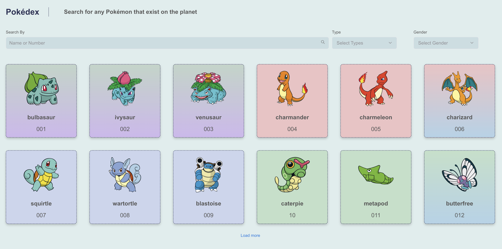

# Pokedex

This is POC Project to try out **Sapient Slingshot** - an AI tool and **Github Pages** deployment.

## Assignment
Follow any Generative AI tools of your choice (e.g. Slingshot, AI Code Companion, Chat GPT, etc), our recommendation is Slingshot. By using the Gen AI tool you need to add/update the code into the above selected code base.All these steps mentioned below, you need to follow these using Gen AI tools and the prompt engineering best practices you learned.

- Add Type script related configurations (tslint, build, dev commands etc)
- Convert the JS code into the Typescript
- Add Storybook configurations
- Add Storybook for all the components
- Add React Testing Library configurations
- Write the test cases using RTL

## Evalution Result
|Criteria|	Score|	Explanation|
|:--------|:-----------:|:-------------|
|Code Quality|9/10|The use of ESLint and plugins like Prettier, React-Hooks, and JSX-A11y indicates a focus on code quality. Accessibility and styling are well-considered.|
|TypeScript|10/10|The TypeScript setup is robust with the use of @typescript-eslint, ensuring type safety and enhanced tooling.|
|React Testing Library|8/10|React Testing Library is included, showing a commitment to testing, although further details on test cases are not provided.|
|Storybook|8/10|Storybook is detected, indicating support for visual component building, although implementation specifics are absent.|
|Jest|8/10|Jest is noted, suggesting testing frameworks presence, but additional test examples or configurations are not detailed.|

## Preview

[Storybook Components](https://kathuria.github.io/pokedex/storybook)

[Pokedex](https://kathuria.github.io/pokedex)

PS: Project is licensed under [Apache](./LICENSE).